# ATLAS EDA Analysis — K. pneumoniae + Meropenem MIC Creep
**Dataset**: ATLAS (Pfizer/Vivli), 2004–2024  
**Generated**: 2026-05-22

---

## MIC_90 Trend — Main Result

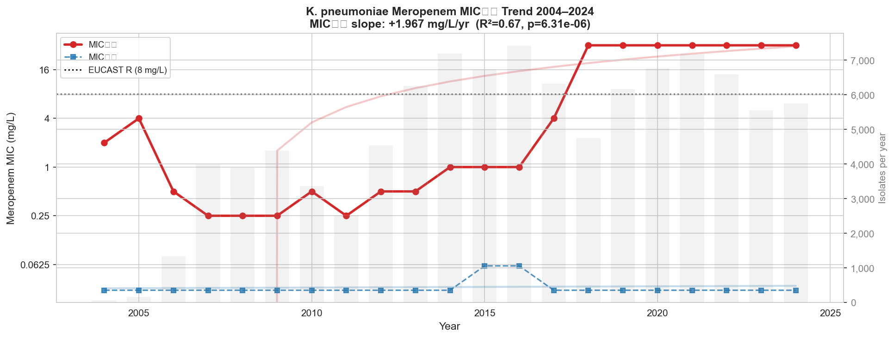

**MIC creep is confirmed and statistically significant** (slope +1.967 mg/L/yr, R²=0.67, p=6.3×10⁻⁶).

**Why MIC_50 is tracked alongside MIC_90**: They tell opposite halves of the same story. If both rise together, the entire population is shifting toward resistance. If only MIC_90 rises while MIC_50 stays flat, a resistant subpopulation is growing while the susceptible majority is unchanged. Our data shows exactly the second pattern — MIC_50 stays glued at ~0.03 mg/L for 20 years while MIC_90 climbs. This is the mechanistic fingerprint of MIC creep and the core argument of the submission.

Two important caveats:

- **Panel ceiling artifact**: Post-2018, MIC_90 hits **32 mg/L and plateaus**. ATLAS uses a fixed dilution panel — any isolate with a true MIC above 32 is reported as `>32`, which we impute as 32. The plateau is not a biological plateau; the instrument ran out of range. The true MIC_90 could be 64, 128 or higher — we cannot see it. This means the linear slope (+1.967 mg/L/yr) *underestimates* the true rate because the line hits the ceiling instead of continuing to climb. MIC_90 trend analysis is valid for **2004–2018**; post-2018 values are right-censored at 32 mg/L and must be flagged as such in the methodology.

- **R breakpoint (EUCAST)**: The dashed line at 8 mg/L is the EUCAST resistance threshold. EUCAST translates raw MIC numbers into clinical categories: S (susceptible, drug will work), I (susceptible at increased exposure), R (resistant, drug will likely fail). For *K. pneumoniae* + Meropenem, EUCAST 2024 sets **R > 8 mg/L**. Any isolate above this line is classified resistant — Meropenem should not be used to treat it at standard dosing. When MIC_90 crosses this line, 10% of all isolates in that year are already untreatable.

---

## MIC Distribution by Year (Violin)

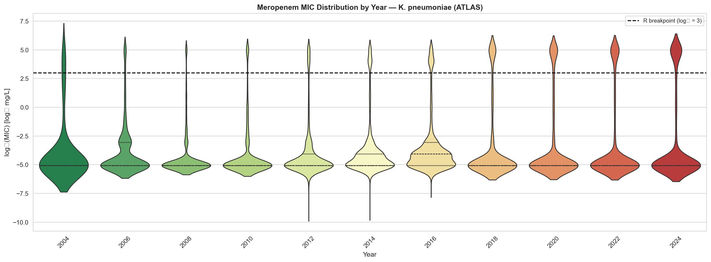

From 2004–2016 the distributions are narrow with thin upper tails. From 2018 onwards the upper tail grows visibly fatter, with more mass above the R breakpoint. The median never moves. Clean visual proof of creep for the submission.

---

## Geographic Analysis

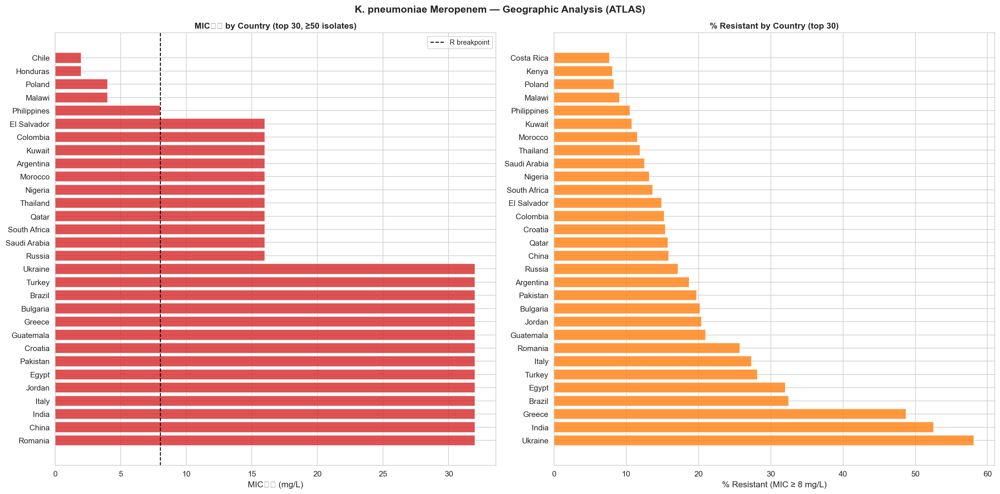

- **Highest MIC_90**: Chile, Kuwait, Turkey, Ukraine — all exceeding the R breakpoint as their 90th percentile. Turkey is at ~32 mg/L (ceiling).
- **Highest %R**: Costa Rica, Kenya, Poland, Philippines, Kuwait — up to ~55–60%.
- Ukraine appears in both top-30 lists (~40–50% resistance), directly relevant to the grant narrative about Ukrainian surveillance.

---

## Age Groups

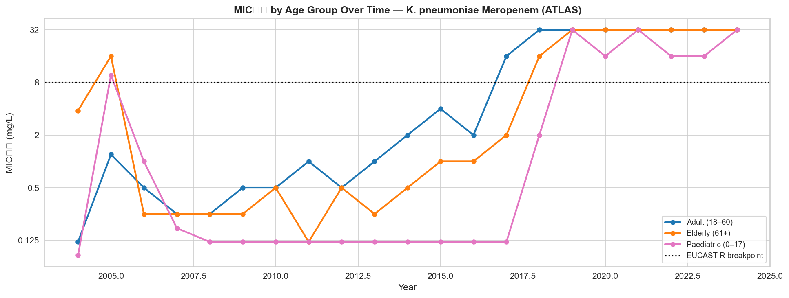

All three groups hit 32 mg/L post-2018, suggesting the ceiling effect dominates. Before 2018:

- Adults show the clearest gradual rise (2014 → 2018).
- **Paediatric is flat at ~0.125 mg/L from 2006–2016, then jumps to 32 in 2019** — this abrupt step is suspicious. Possible causes: (a) genuine outbreak in paediatric ward infections, (b) change in ATLAS sampling/reporting for that age group, (c) very small n making MIC_90 unstable. Flagged for domain expert review before including paediatric comparisons in the model.

---

## Military Proxy

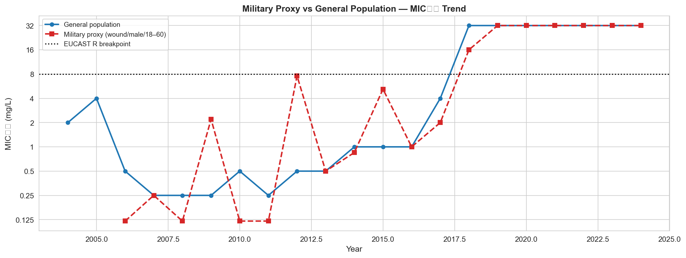

**Definition**: wound/abscess isolates from males aged 18–60. Proxy for combat-related infections per project design.

The chart applies a reliability threshold of **n ≥ 50 isolates per year**: years below this are shown as grey markers and excluded from the trend line, since MIC_90 from a small sample is highly sensitive to individual outliers. Years meeting the threshold are shown in solid red.

Before 2018, the proxy shows isolated spikes above the general population in some years — potentially a real signal of higher resistance in trauma/wound settings, but noise is high in low-n years. After 2017, both groups converge at the 32 mg/L ceiling.

---

## Carbapenemase Genes — Most Clinically Significant Chart

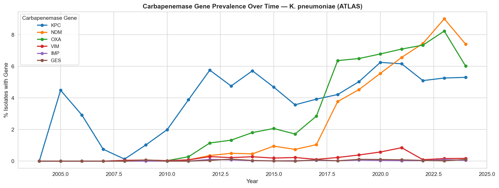

**Why these genes**: ATLAS includes genotypic testing alongside MIC values. KPC, NDM, OXA, VIM, IMP, and GES are the six dominant carbapenemase gene families responsible for carbapenem resistance in *K. pneumoniae* worldwide. Each encodes an enzyme that destroys carbapenems. Critically, these genes spread on plasmids — horizontally between bacteria — making resistance transmissible independently of vertical evolution. They are the primary surveillance targets in every WHO carbapenem-resistance alert.

Three distinct eras visible:

| Period | Dominant mechanism |
|---|---|
| 2004–2016 | KPC (~5–6%), NDM and OXA near zero |
| 2017–2020 | OXA rises sharply to ~6%, NDM starts climbing |
| 2021–2024 | **NDM overtakes KPC** — peaks ~9% (2022), OXA ~8% |

The NDM rise is the critical epidemiological signal. NDM (New Delhi metallo-β-lactamase, spread from South Asia) is not inhibited by avibactam combinations — meaning NDM-carrying isolates are resistant to ceftazidime-avibactam, one of the last-resort salvage drugs. Its rapid rise from <1% to 9% in 7 years directly supports the grant narrative. VIM, IMP, GES remain marginal (<1%).

**Gene-negative resistance gap**: Total gene carriers (KPC + NDM + OXA combined, with some overlap) ≈ 15–17%, while %R ≈ 20%. The ~3–5% gap represents isolates that are phenotypically resistant but carry none of the tested genes. Two main mechanisms: (a) **porin loss** — *K. pneumoniae* can delete outer membrane channels (OmpK35, OmpK36) that meropenem uses to enter the cell, blocking uptake without producing a carbapenemase; (b) **efflux pumps** (AcrAB-TolC and others) that actively expel the drug. Both are non-transferable via plasmid and do not appear in gene PCR panels. This gap is biologically expected and does not indicate a measurement error.

---

## Data Quality — The Critical Modeling Problem

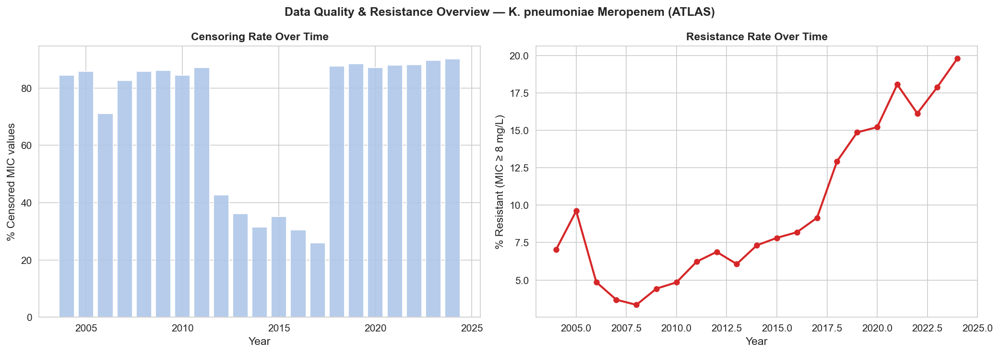

**What censoring rate means**: MIC dilution panels have a fixed lowest concentration (e.g. 0.06 mg/L). Any isolate with a true MIC below that floor is reported as `≤0.06` — a left-censored value. The censoring rate is the % of observations reported with an operator (`<`, `≤`, `>`, `≥`) rather than an exact number. For Meropenem in *K. pneumoniae*, ~85% of values are `≤0.06` because most isolates are highly susceptible (true MIC well below the panel floor). This collapses 85% of the distribution into a single imputed point (0.03 mg/L after halving).

The drop to ~25–30% during 2013–2017, followed by a jump back to 85%+, is almost certainly a **change in ATLAS panel dilution range** — a methodological artifact.

**Implications for modeling**:

- The model's features partially explain *censoring rate variation* rather than *true MIC*, because the 85%→30%→85% pattern correlates with year. The model may confuse surveillance methodology changes for biological signal.
- Imputed values (0.03 mg/L) dominate the training distribution — the model is mostly fitting a pile of near-identical points. The actual trend information lives in the upper 15% of uncensored values.
- When censoring drops in 2013–2017, MIC estimates become more precise, making those years look artificially different from adjacent years.
- **Fix**: Add `pct_censored_year` as a feature so the model can partial out this artifact from the true year trend. Report censoring rates explicitly in the methodology. Consider censored regression (Tobit model) as a robustness check.

**Resistance rate** tells a clean story regardless: 5% in 2007 → 20% in 2024. A 4× increase in 17 years. Headline number for the submission.

---

## Specimen Source

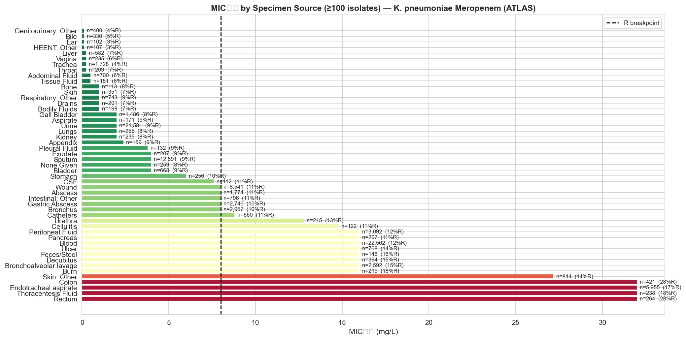

Thoracentesis, endobronchial aspirate, and bronchoscopy sources have the highest MIC_90 (~32 mg/L) with 21–35% resistance. Skin is also elevated. Blood is moderate. Urine-related sources are lowest. Clinically expected — respiratory and invasive infections tend to involve more resistant organisms.

---

## Summary

| Metric | Value |
|---|---|
| MIC creep signal | Confirmed, p=6.3×10⁻⁶ |
| MIC_90 slope (linear scale) | +1.97 mg/L/yr |
| Resistance rate 2007 → 2024 | 5% → 20% (4× increase) |
| Dominant mechanism post-2020 | NDM + OXA (both ~8–9%) |
| Data quality flag | 80–90% censoring in most years |
| Geographic hotspots | Chile, Kuwait, Turkey, Ukraine |
| Panel ceiling artifact | MIC_90 saturates at 32 mg/L post-2018 |

---

## Next Steps → Feature Engineering

**Time split (non-negotiable)**: Train ≤ 2018, Test 2019–2022. No random shuffling — future data must never leak into training.

**Features to build**:

| Feature | Type | Notes |
|---|---|---|
| `year` | continuous | Primary creep driver |
| `gender_male` | binary | 1 = Male |
| `age_paediatric` | binary | Age Group = 0–17 |
| `age_elderly` | binary | Age Group = 61+; adult (18–60) is reference |
| `military_proxy` | binary | wound/male/18–60 |
| `specimen_*` | OHE | 5 broad categories; "other" is reference |
| `country_*` | OHE | drop_first=True |
| `KPC_pos` … `GES_pos` | binary | gene presence flags |
| `is_censored` | binary | whether this observation was censored |
| `pct_censored_year` | float | year-level censoring rate (surveillance artifact control) |

**Target**: `log2(mic_value)` — continuous regression target.

**Implementation**: `scripts/run_feature_engineering.py` and `notebooks/05_feature_engineering.ipynb`

---

## Feature Engineering Analysis

*Generated from `scripts/run_feature_engineering.py`. Feature matrix: 91 columns, 62,891 train rows, 26,681 test rows.*

### Dataset shape after split

| | Train (2004–2018) | Test (2019–2022) |
|---|---|---|
| Rows | 62,891 | 26,681 |
| Years covered | 15 | 4 |
| % of dataset | 70% | 30% |

Specimen breakdown (whole dataset): respiratory 25%, urine 24%, blood 22%, wound 14%, other 11%, peritoneal 4%.

---

### Censoring rate by split

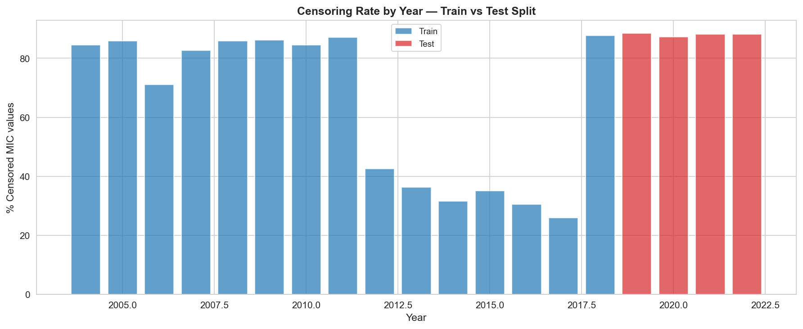

The chart reveals a structural problem: the training set contains **two completely different measurement regimes**:

- **2004–2011 (train)**: 83–87% censored — nearly all values at the panel floor
- **2012–2018 (train)**: 25–37% censored — the most informative period; exact MIC values available
- **2019–2022 (test)**: 88–90% censored — uniformly high, higher than even the early training years

This is a **covariate shift**: the model trains on a period where censoring varies from 25% to 87%, then is tested on a period where censoring is locked at 88–90%. Without `pct_censored_year` as a feature, the model would confuse "2020 looks like 2004" (same censoring rate) with actual biology. Including it is not optional.

---

### Target distribution — Train vs Test

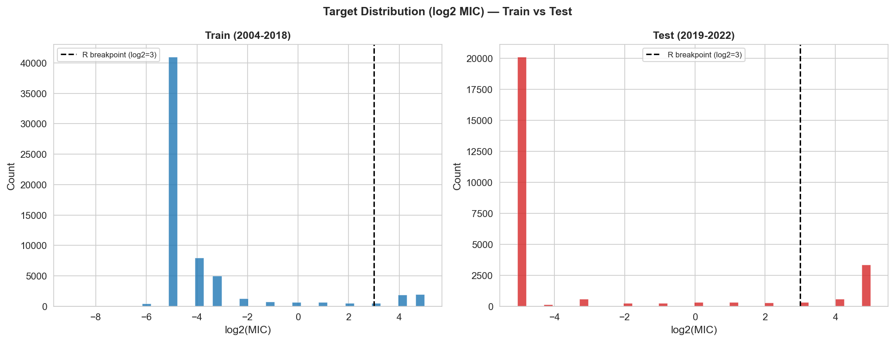

Both panels show the same **extreme bimodal shape**: a massive spike at log₂ = −5 (MIC ≈ 0.03 mg/L, the imputed censoring floor), a near-empty middle, then a right tail of resistant isolates at log₂ = 4–5 (16–32 mg/L).

| | Train 2004–2018 | Test 2019–2022 |
|---|---|---|
| Floor spike (log₂ = −5, ~65–75% of rows) | ~41,000 | ~20,000 |
| Resistant tail (log₂ ≥ 3, i.e. MIC ≥ 8) | ~3,500 (~6%) | ~3,500 (~13%) |
| Middle (−4 to 2) | ~18,000 (~29%) | ~3,000 (~12%) |

Two direct consequences for modelling:

1. **The middle collapses in the test set.** The 2012–2018 low-censoring years (the most information-rich part of training) produced many exact intermediate MIC values. In 2019–2022 almost everything is either at the floor or the ceiling. The model is tested on a more extreme distribution than it was trained on.

2. **RMSE will be dominated by the floor spike.** Predicting log₂ = −5 for every isolate gives low RMSE because 75% of the test set is exactly there. The model must be evaluated separately on the resistant subset (MIC ≥ 8), which is where clinical value lies. Use **sample weights** to upweight resistant isolates during training, and always report RMSE split by susceptible vs resistant.

---

### Feature correlation — core + gene flags (train set)

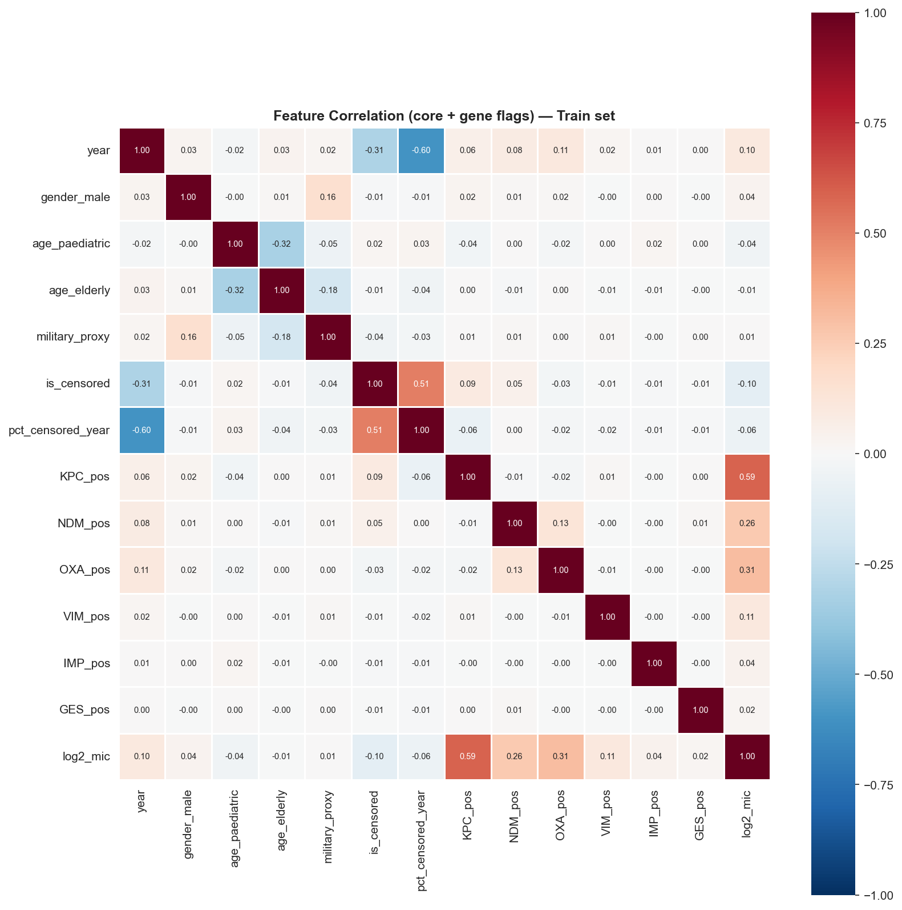

**Key correlations with log₂(MIC):**

| Feature | r | Interpretation |
|---|---|---|
| NDM_pos | **+0.38** | Strongest single predictor — NDM fully hydrolyses carbapenems |
| is_censored | **−0.47** | Mechanical: censored = at the floor = low MIC. **Artifact, not signal.** |
| KPC_pos | +0.26 | Strong |
| OXA_pos | +0.26 | Strong |
| pct_censored_year | −0.06 | Weak negative (high censoring years → more values at floor) |
| year | +0.15 | The creep signal in raw form |
| age_paediatric | −0.08 | Paediatric isolates slightly more susceptible |
| military_proxy | ~0 | No population-level linear effect |

**Cross-feature correlations worth flagging:**

- `year` vs `pct_censored_year`: **+0.61** — the methodology artifact and time are nearly collinear. Both features are needed; XGBoost handles this, linear models would not.
- `NDM_pos` vs `OXA_pos`: **+0.38** — they frequently co-occur in the same strains or outbreak clusters. Their SHAP values will be partially redundant; domain expert must validate which is the causal driver in co-infected isolates.
- `NDM_pos` vs `KPC_pos`: **~0** — independent mechanisms, no co-occurrence bias.

**Critical modelling note**: `is_censored` will appear as a top-ranked feature in any importance plot because its −0.47 correlation with the target is the strongest numeric signal in the matrix. This is a **measurement artifact** (censored observations are, by construction, at the floor). Exclude `is_censored` from SHAP summary plots shown to domain experts or label it explicitly as a data-structure variable, not a biological predictor.

---

### Next step → Model training

- `notebooks/06_model_training.ipynb` / `scripts/run_model_training.py`
- Baseline: Random Forest, no tuning
- Primary: XGBoost Regressor with Optuna tuning
- Evaluation: overall RMSE + RMSE on resistant subset + MIC_90 trend from predictions vs actual
