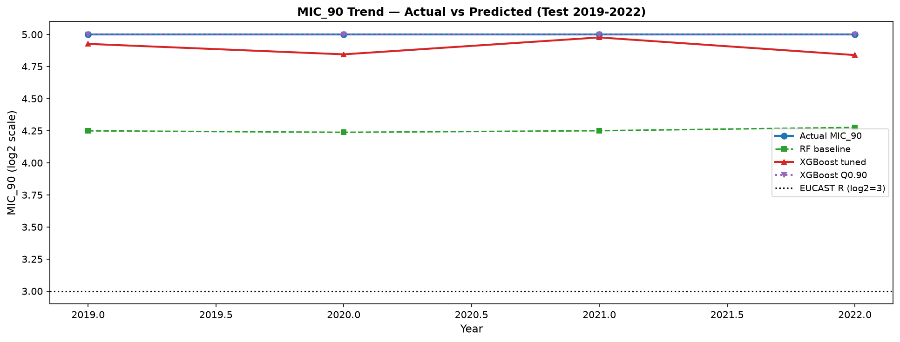

# Model Training Results — K. pneumoniae + Meropenem
**Generated**: 2026-06-29 13:38
---
## Evaluation Metrics
| Model | RMSE (all) | MAE (all) | R2 (all) | RMSE (R subset) | MAE (R subset) | N resistant |
|---|---|---|---|---|---|---|
| RF baseline | 1.7938 | 1.1502 | 0.7609 | 3.1124 | 2.4026 | 4,305 |
| XGBoost tuned | 1.8681 | 1.3826 | 0.7406 | 2.3821 | 1.4421 | 4,305 |
| XGBoost Q0.90 | 3.0968 | 2.4251 | 0.2873 | 1.3644 | 0.7308 | 4,305 |

> **Note**: RMSE on the resistant subset (MIC >= 8 mg/L) is the clinically relevant metric. The full-set RMSE is dominated by the ~75% of isolates imputed at the censoring floor (log2=-5).

---

## MIC_90 Trend — Actual vs Predicted



---

## Residuals by Year


---

## RMSE by Year


---

## SHAP Feature Importance


---

## XGBoost Best Hyperparameters (Optuna)

```json
{
  "n_estimators": 400,
  "max_depth": 5,
  "learning_rate": 0.012047313045711654,
  "subsample": 0.6827050210852758,
  "colsample_bytree": 0.8880723309391383,
  "min_child_weight": 12,
  "gamma": 0.8757300090772471,
  "reg_alpha": 2.8208074066356317,
  "reg_lambda": 2.02479393508185
}
```

---

## Next Steps

- Review SHAP values with domain expert — confirm biological plausibility
- Build FastAPI endpoint: `src/api/main.py`
- Push model artefact to Hugging Face Hub
- Prepare submission write-up
